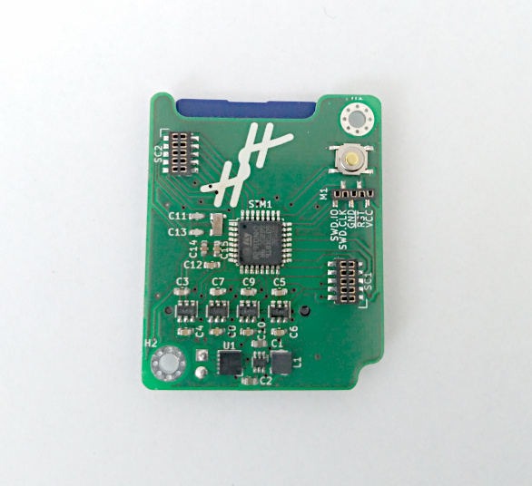
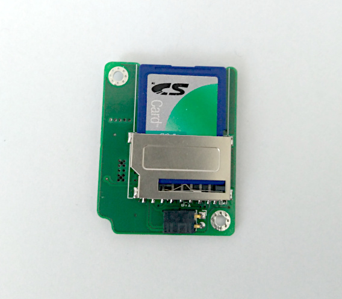

data-logger
===========

Gadget writing sensor data to an SD card.

Assembly Snapshots
==================
.. image:: assets/mcu_populated.jpg

Tests
=====

+---------------------------+--------------+
|unit                       |    status    |
+===========================+==============+
|SWD                        |      OK      |
+---------------------------+--------------+
|external clock             |      OK      |
+---------------------------+--------------+
|step-up power converter    |      OK      |
+---------------------------+--------------+
|reverse polarity protection|      OK      |
+---------------------------+--------------+
|communication with SD card |      OK      |
+---------------------------+--------------+
|reading files from SD card |      OK      |
+---------------------------+--------------+
|writing files from SD card | to be tested |
+---------------------------+--------------+
|communication with sensors | to be tested |
+---------------------------+--------------+

Improvement Ideas
=================

* a status LED would be helpful
* connect the card detection
* power switch for the SD card

References
==========
`FATFS <http://elm-chan.org/fsw/ff/00index_e.html>`_
