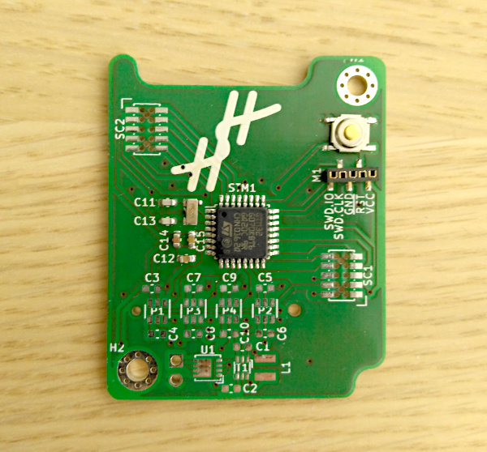

data-logger
===========

Gadget writing sensor data to an SD card.

First Tests
===========

+--------------+------+
|unit          |status|
+--------------+------+
|SWD           |  OK  |
+--------------+------+
|external clock|  OK  |
+--------------+------+

References
==========
`FATFS <http://elm-chan.org/fsw/ff/00index_e.html>`_
